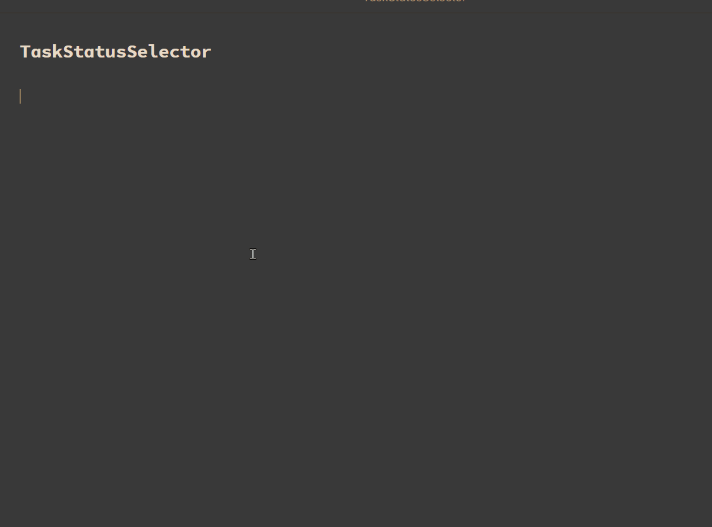

# Obsidian Task Status Selctor

A simple minimalistic plugin to help dealing with custom checkbox statuses.

## What do I get with this plugin?

- A command: `Task Status Selector: Add Task Status`

- (optional) inline autocompletion when typing `- [`

### What is the `Add Task Status` command doing?

A (searchable) Suggester will pop up showing all possible task-statuses.

If the **active line is empty**:

- A new task with the selected status is created

If the **active line contains a task**:

- The task status is changed to the selected status

If one (or more) **lines of text are selected**:

- All tasks within the text are changed to the selected status

Here's how it looks like in action:

## Settings

The settings allow to disable inline-autocompletion and to customize the list of suggested task-statuses.

