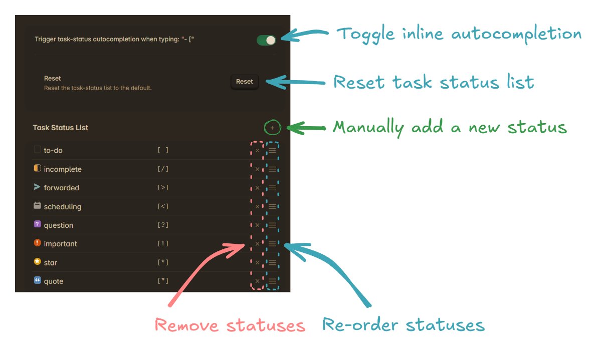

# Task Status Selector

A simple minimalistic plugin to help dealing with custom checkbox statuses.  
(on Desktop and Mobile)

## What do I get with this plugin?

- A command: `Task Status Selector: Add Task Status`
- (optional) inline autocompletion when typing `- [`

---

> [!TIP]
> 
> #### The `Add Task Status` command can be used to <ins>add or change</ins> task statuses!
> 
> - <ins>**Active line is empty**:</ins> A new task with the selected status is created
> - <ins>**Active line contains a task**:</ins> The task status is changed to the selected status
> - <ins>**Lines of text are selected**:</ins> All tasks within the text are changed to the selected status

## Settings

The settings allow to disable inline-autocompletion and to customize the list of suggested task-statuses.

